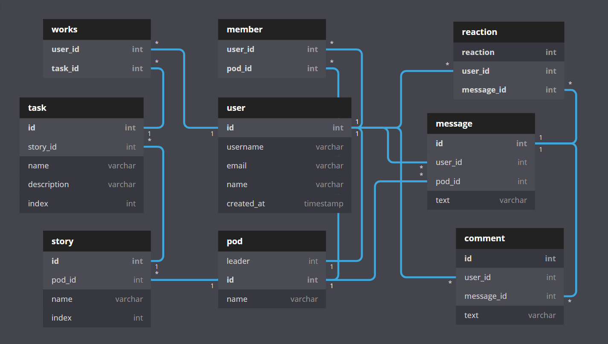

<h3 align="center">Working with team made simple, secure and fast.</h3>
<p align="center">The most advanced open-source project management and communication tool for teams.</p>
<br />

<p align="center">
    
</p>

<br>

Pods is a free and open-source project management and communication tool for your team projects.

- **Kanban Project Board**. Keep track of your todos and status, in your kanban board.
- **Auto Sync**. No matter what changes you make, even drag-n-drop tasks positions, get synced with all other pod members.
- **Real-time Communication**. Chat with pod members in real-time. No need for refresh. You send, they receive. It is that simple.
- **Assign Tasks**. You can quickly assign tasks to pod members
- **Secure Authetication**. Uses Redis store to keep track of sessions you are logged in. Your data in your hands.

## Getting Started

Follow the steps below, after cloning the project:

### ⏳ Installation

- (Use **yarn** to install (recommended). [Install yarn with these docs](https://yarnpkg.com/lang/en/docs/install/).)

```bash
yarn install
```

**or**

- (Use npm to install)

```bash
npm install
```

This command installs all the dependencies needed for project to run locally.

Enjoy 🎉

### 🖐 Requirements

**Installing:**

- Node
- Yarn

**Database and Cache Storage:**

- PostgreSQL
- Redis

**Note - Make .env and specify all the information about your local database, redis and other.**

## Contributing

Please read our [Contributing Guide](./CONTRIBUTING.md) before submitting a Pull Request to the project.
