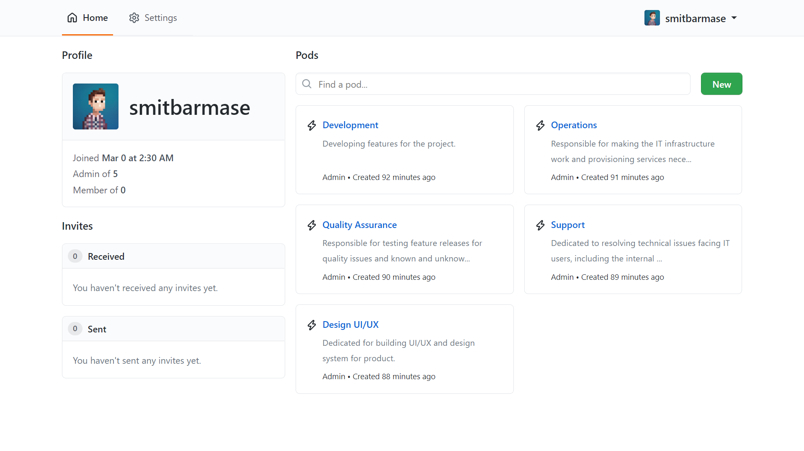
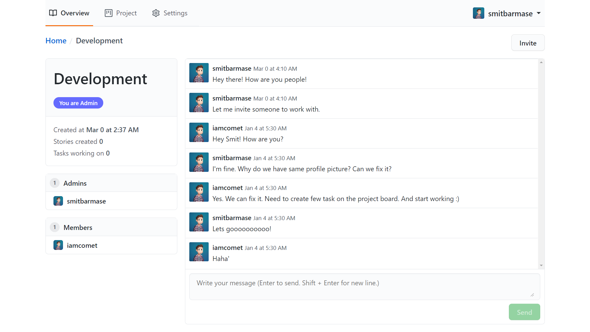
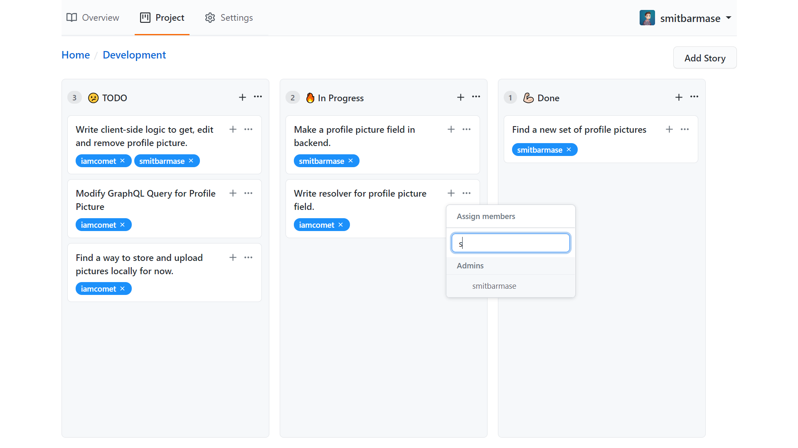

<h3>A Project Management and Communication Tool for Teams.</h3>

## 👨🏻‍🚀 Tech Stack

- **Client** - **React, Apollo Client, Primer Components, React-Beautiful-DND, React-Hook-Form**
- **Server** - **Node, Apollo Server Express, TypeORM, Type GraphQL, GraphQL Subscriptions, Argon, Connect-Redis**
- **Database** - **PostgreSQL, Redis**

## 🧐 Features

### Team Management and Communication

- **Create pods and invite users as members and admins.**
- **Websocket based messaging using graphql subscription.**
- **Less data usage with cursor-pagination while fetching saved messages.**
- **Cache modification for faster UI updates without reload using apollo client.**

### Project Management

- **Drag-n-drop project board in sync with postgresql database.**
- **Lexo-ranking algorithm to store order of drag-n-drop in a board.**
- **Assign tasks to members on project board.**
- **Add multiple stories and tasks to the project board.**

### Authetication and Security

- **Secure authetication with diffrent access levels for diffrent APIs (Public, Authenticated, Member and Admin).**
- **Cookie-session based authetication using redis.**

## 📸 Screenshots

### Home - Create and Search Pods.



### Team Communication - Chat with Team and Invite Members and Admins.



### Project Management - Create Tasks and Stories. Assign Team Users to the Task.



## ⏳ Installation

Follow the steps below, after cloning the project:

- (Use **yarn** to install (recommended). [Install yarn with these docs](https://yarnpkg.com/lang/en/docs/install/).)

```bash
yarn install
```

This command installs all the dependencies needed for project to run locally.

This project uses `yarn workspace` for managing `web` and `server` folders.

- To run the project in development locally use:

```bash
yarn dev
```

- To generate GraphQL schema types for client from server.

```bash
yarn generate
```

- To deploy web to heroku.

```bash
yarn deploy-web
```

- To deploy server to heroku.

```bash
yarn deploy-server
```

### 🖐 Requirements

**Installing:**

- Node
- Yarn

**Databases:**

- PostgreSQL
- Redis

**Note - Make .env and specify all the information about your local database, redis and other.**

## Contributing

Please read our [Contributing Guide](./CONTRIBUTING.md) before submitting a Pull Request to the project.
